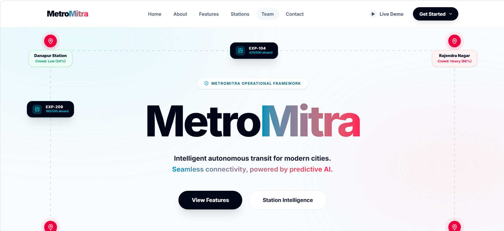
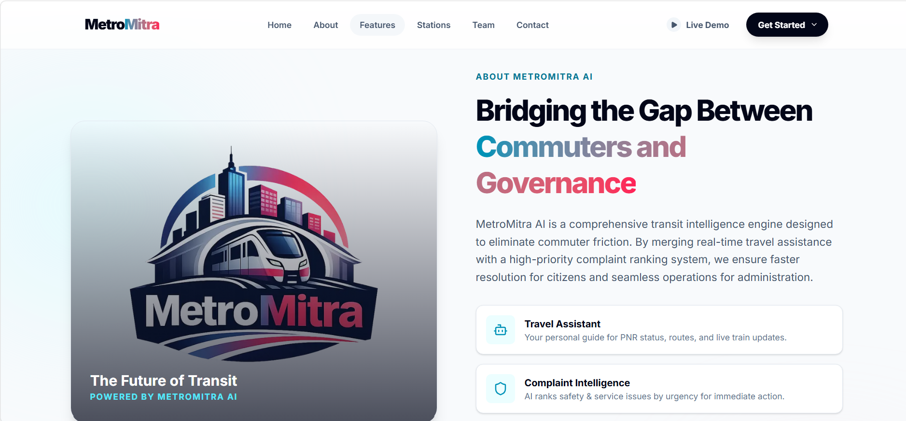
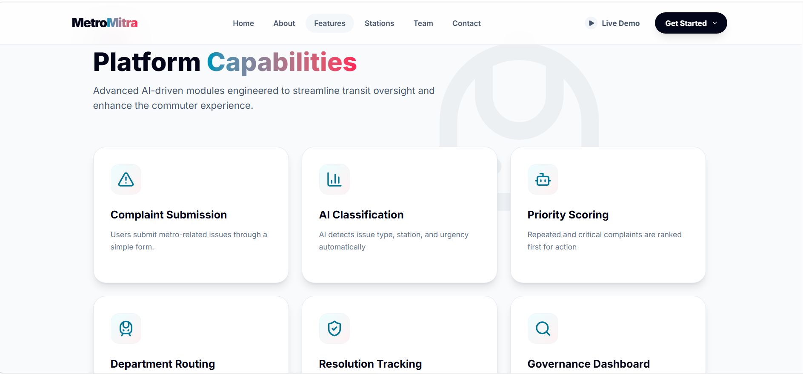
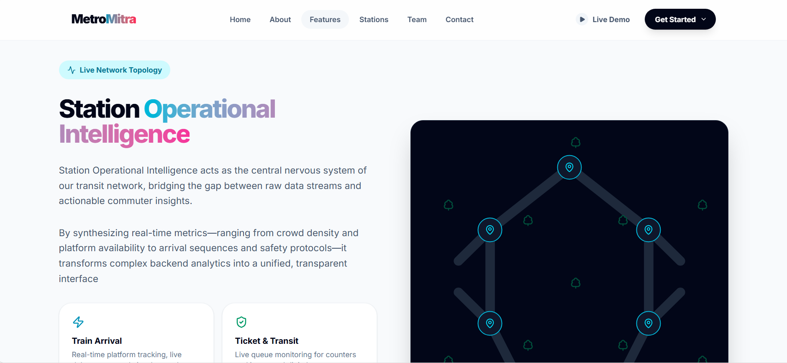
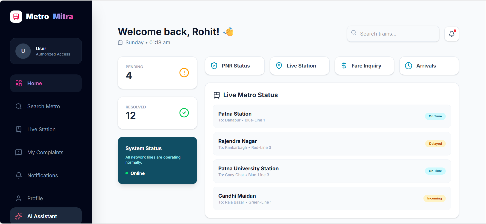
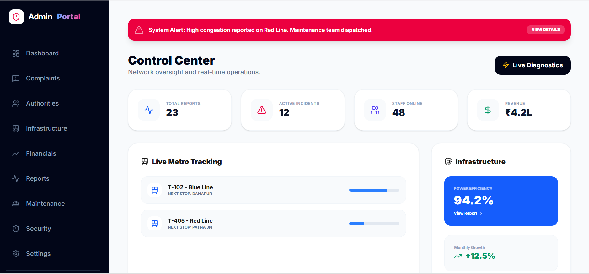
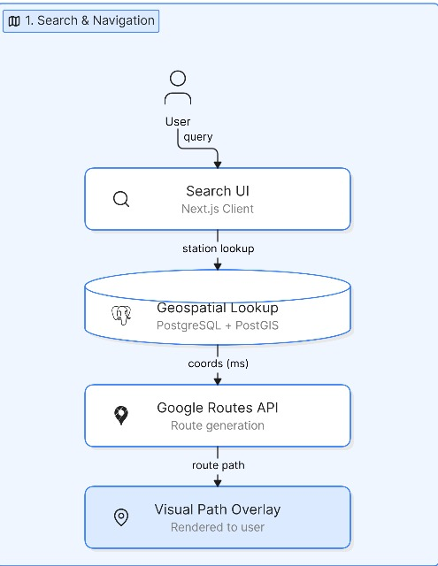
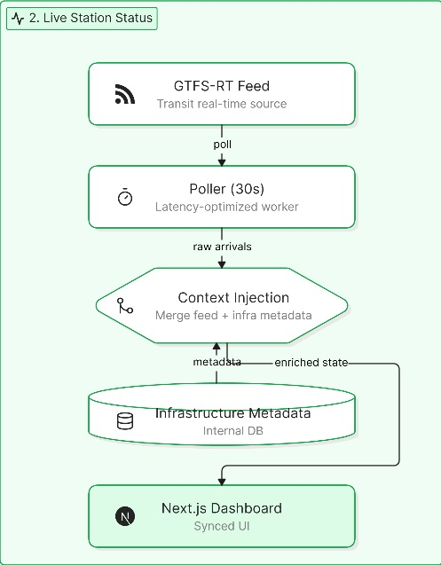
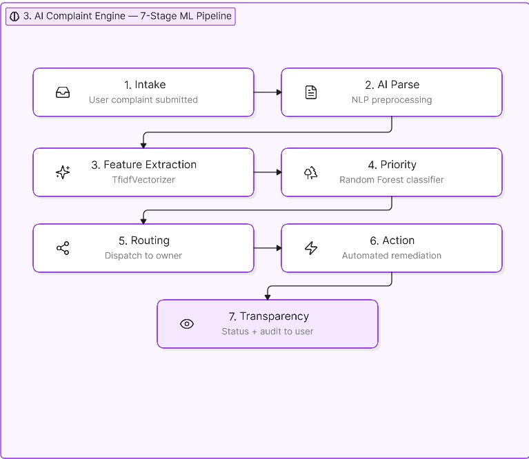

# Metro Mitra
> **A full-stack, AI-driven management ecosystem designed to redefine the urban commuter experience through real-time data, geospatial intelligence, and automated maintenance routing.

---**

MetroMitra AI is a comprehensive transit intelligence engine designed to eliminate commuter friction. By merging real-time travel assistance with a high-priority complaint ranking system, we ensure faster resolution for citizens and seamless operations for administration.

---

##  Interface Showcase

###  Landing Page

*A high-conversion landing page featuring smooth scroll animations and clear service navigation to our transit intelligence portal.*

### ℹ About MetroMitra

*A dedicated page detailing our mission to revolutionize urban mobility through AI-driven transit solutions.*

###  Core Features

*A comprehensive breakdown of our AI-powered complaint engine and real-time monitoring tools.*

###  Station Intelligence

*An interactive map view providing real-time data lookups and geospatial intelligence for all metro stations.*

###  User Dashboard 

*A personalized commuter portal for tracking transit updates, viewing service history, and submitting real-time complaints.*

###  Admin Intelligence Dashboard

*A centralized command center for administrators featuring AI-driven ticket prioritization, infrastructure monitoring, and automated maintenance routing.*

---

##  Key Features

 **1: 1: AI-Powered Complaint Engine**: Utilizes a 7-stage NLP pipeline for automatic ticket categorization and prioritization using ml model random classifier
 **2: Geospatial Intelligence**: Decoupled architecture leveraging PostgreSQL and PostGIS for high-performance coordinate lookups.
 **3: Role-Based Access Control (RBAC)**: Secure partitioning ensuring distinct environments for commuter services and administrative oversight.
 **4: 4: Real-time Synchronization**: Latency-optimized polling mechanism for live GTFS-RT transit data.
 **5: 5: Fully Responsive**: Custom Tailwind CSS architecture ensures a perfect experience on any mobile device.

---

##  Tech Stack & Hosting

- **1.Frontend**: Next.js 15+ (App Router, Server Components)
- **2.Backend**: Node.js, Express
- **3.Database**: PostgreSQL (PostGIS)
- **4.AI Integration**: Groq LPU™ API
- **5.Hosting**: Vercel (Continuous Deployment from GitHub)

## Architecture Diagramme

###  Live Search & Status

*A high-conversion landing page featuring real-time station lookup, live transit status, and instant route information.*

###  Live station Intelligence

*An interactive hub showcasing our geospatial intelligence engine, providing live operational data and station-specific analytics.*

###  AI Complaint Management

*A powerful AI-driven portal that utilizes a 7-stage NLP pipeline for automatic ticket categorization, prioritization, and rapid maintenance routing.*

---

## 🚀 Deployment on Vercel

This project is optimized for Vercel. You can view the live application here: [**MetroMitra Live**](https://metro-mitra-rose.vercel.app/)

To deploy your own version:
1. Push your code to a GitHub repository.
2. Connect your repository to **Vercel**.
3. Configure your environment variables (`DATABASE_URL`, `GROQ_API_KEY`, `NEXTAUTH_SECRET`) in the Vercel dashboard.
4. Deploy and enjoy!

